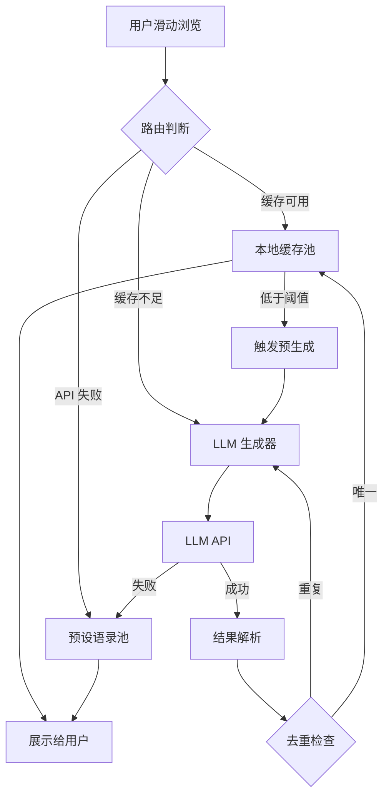

# LLM 无限语录生成

Feature Name: llm-quote-generation
Updated: 2026-05-01

## Description

通过集成 LLM API 实现语录的动态生成，结合本地缓存和智能调度策略，让用户获得"无穷无尽"的新鲜语录体验。采用混合模式：预设 30 条高质量语录 + LLM 实时生成，确保内容质量和系统稳定性。

## Architecture



## Components and Interfaces

### 1. QuoteGenerator (LLM 生成器)

```javascript
class QuoteGenerator {
  // 调用 LLM API 生成单条语录
  async generate(category?: string): Promise<Quote>
  
  // 批量预生成
  async batchGenerate(count: number): Promise<Quote[]>
}
```

**Prompt 模板**:
```
请生成一条打动人心的语录，要求：
- 类别: {category}（哲学/心理学/反常识/励志 四选一）
- 格式: 中文正文(20-50字) + 英文翻译 + 真实来源 + 作者 + 背景说明 + 标签
- 风格: 启发人心、打动人心、鼓舞人心
- 必须返回 JSON 格式: {"zh":"", "en":"", "source":"", "author":"", "context":"", "tag":"", "category":"", "badge":""}
```

### 2. QuoteCache (缓存管理器)

```javascript
class QuoteCache {
  // 从缓存获取下一条
  async next(): Promise<Quote>
  
  // 预填充缓存
  async fill(targetCount: number): Promise<void>
  
  // 检查是否需要补充
  needsRefill(): boolean  // 低于 5 条时返回 true
  
  // 添加语录到缓存
  add(quote: Quote): void
  
  // 去重检查
  isDuplicate(quote: Quote): boolean  // 基于正文相似度
}
```

### 3. QuotaManager (额度管理器)

```javascript
class QuotaManager {
  // 检查是否还有额度
  canGenerate(): boolean  // 每日上限 100 次
  
  // 记录一次调用
  recordUsage(): void
  
  // 获取当日统计
  getStats(): { used: number, remaining: number, resetAt: string }
}
```

### 4. QuoteRouter (路由调度器)

```javascript
class QuoteRouter {
  // 获取下一条语录（核心入口）
  async getNextQuote(): Promise<Quote>
  
  // 内部逻辑:
  // 1. 检查缓存
  // 2. 缓存不足时触发预生成
  // 3. API 失败时降级到预设池
  // 4. 额度用尽时切换预设模式
}
```

## Data Models

### Quote (语录对象)

```typescript
interface Quote {
  id: string              // 'llm-' + timestamp 或 'q' + index
  zh: string              // 中文正文
  en: string              // 英文翻译
  source: string          // 来源（书籍/电影/演讲等）
  author: string          // 作者
  context?: string        // 背景说明
  tag: string             // 标签 如 #自由
  category: string        // 'literature' | 'philosophy' | 'psychology' | 'counterintuitive'
  badge: string           // '晨曦之光' | '哲思之光' | '心光' | '逆光'
  generatedAt: number     // 生成时间戳
  isLLM: boolean          // 是否为 LLM 生成
}
```

### CacheEntry (缓存条目)

```typescript
interface CacheEntry {
  quote: Quote
  shownAt?: number        // 首次展示时间
  showCount: number       // 展示次数
}
```

### Storage Schema (localStorage)

```javascript
{
  // 缓存池 (最多 50 条)
  'glimmer_cache': CacheEntry[],
  
  // 展示历史 (最近 200 条 ID)
  'glimmer_history': string[],
  
  // 额度统计
  'glimmer_quota': {
    date: '2026-05-01',
    used: 0,
    limit: 100
  },
  
  // 预设语录索引（用于混合模式）
  'glimmer_preset_index': 0
}
```

## Correctness Properties

1. **不重复性**: 用户连续浏览 200 条语录内不会出现重复内容
2. **可用性**: 任何情况下（断网/API 故障/额度耗尽）都能展示语录
3. **一致性**: LLM 生成的语录格式必须与预设语录完全一致
4. **成本控制**: 每日 API 调用次数严格不超过设定上限

## Error Handling

| 场景 | 处理策略 |
|------|----------|
| LLM API 超时（>5s） | 回退到缓存，缓存为空时用预设语录 |
| LLM API 返回格式错误 | 丢弃结果，记录日志，使用预设语录 |
| 连续 3 次调用失败 | 暂停生成 30 分钟，期间使用缓存/预设 |
| 当日额度用尽 | 完全切换预设模式，次日自动恢复 |
| 生成内容重复 | 丢弃并重新生成，最多重试 3 次 |
| 网络断开 | 使用本地缓存，缓存用完用预设 |

## Test Strategy

### 单元测试

1. **QuoteCache 测试**
   - 验证缓存填充逻辑
   - 验证去重机制
   - 验证容量上限淘汰策略

2. **QuotaManager 测试**
   - 验证每日重置逻辑
   - 验证额度计数准确性
   - 验证超额拦截

3. **QuoteRouter 测试**
   - 验证降级链路完整性
   - 验证预加载触发时机

### 集成测试

1. 模拟 LLM API 正常响应，验证端到端流程
2. 模拟 API 超时/错误，验证降级行为
3. 模拟额度耗尽，验证预设模式切换
4. 模拟 200 条连续浏览，验证无重复

### 性能测试

1. 验证 P95 响应时间 < 3 秒
2. 验证缓存命中率 > 80%
3. 验证内存占用稳定（缓存上限 50 条）

## References

[^1]: (index.html#L929) - 现有预设语录数据结构
[^2]: (index.html#L956) - 当前语录切换逻辑
[^3]: (miniprogram/app.js) - 小程序端语录数据
