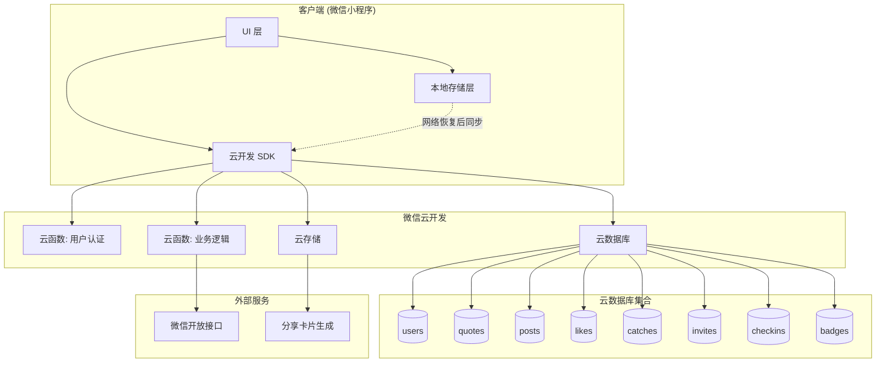

# 病毒式传播系统 - 技术设计

Feature Name: viral-growth-system
Updated: 2026-05-04

## 描述

为 Glimmer 微光应用构建完整的病毒式传播体系，基于微信云开发实现用户登录、云端数据同步、语录卡片分享、邀请裂变、连续打卡、成就徽章等核心能力。系统采用本地优先、云端同步的架构，确保离线可用的同时实现跨设备数据一致性。

## 架构



### 架构说明

- **本地优先**: 所有操作先写入本地存储，确保离线可用
- **云端同步**: 网络可用时自动同步至云端数据库
- **云函数**: 处理敏感逻辑（登录验证、邀请校验、额度计算）
- **云存储**: 存储用户头像、分享卡片图片

## 组件与接口

### 1. 用户认证模块 (`utils/auth.js`)

```javascript
class AuthManager {
  // 微信登录，返回用户信息
  async wxLogin()
  
  // 静默登录（已授权用户）
  async silentLogin()
  
  // 获取当前用户状态
  getUser()
  
  // 退出登录
  logout()
}
```

### 2. 云端数据模块 (`utils/cloud.js`)

```javascript
class CloudManager {
  // 初始化云开发环境
  static init()
  
  // 同步本地数据至云端
  async syncToCloud(dataType, data)
  
  // 从云端拉取数据
  async pullFromCloud(dataType)
  
  // 批量同步
  async batchSync(operations)
}
```

### 3. 分享卡片模块 (`utils/shareCard.js`)

```javascript
class ShareCardGenerator {
  // 生成横版卡片 (16:9)
  async generateLandscapeCard(quote, userInfo)
  
  // 生成竖版卡片 (4:5)
  async generatePortraitCard(quote, userInfo)
  
  // 生成邀请卡片
  async generateInviteCard(inviteCode, userInfo)
  
  // 分享到微信
  async shareToWeChat(imagePath, shareType)
}
```

### 4. 邀请裂变模块 (`utils/invite.js`)

```javascript
class InviteManager {
  // 获取用户邀请码
  async getInviteCode()
  
  // 记录邀请关系
  async recordInvite(inviteCode)
  
  // 发放邀请奖励
  async grantInviteReward(inviterId, inviteeId)
  
  // 查询邀请统计
  async getInviteStats()
}
```

### 5. 打卡模块 (`utils/checkin.js`)

```javascript
class CheckinManager {
  // 执行签到
  async doCheckin()
  
  // 获取连续天数
  getConsecutiveDays()
  
  // 获取本月打卡日历
  getMonthlyCheckins()
  
  // 计算打卡奖励
  calculateReward(consecutiveDays)
}
```

### 6. 成就模块 (`utils/badges.js`)

```javascript
class BadgeManager {
  // 检查并颁发徽章
  async checkAndAwardBadges()
  
  // 获取用户徽章列表
  async getUserBadges()
  
  // 徽章定义
  static BADGE_DEFINITIONS
}
```

## 数据模型

### 云数据库集合设计

#### users (用户集合)

```javascript
{
  _id: "auto-generated",
  _openid: "wx-openid",           // 云开发自动填充
  nickname: "用户昵称",            // 微信昵称
  avatarUrl: "头像 URL",           // 微信头像或云存储 URL
  inviteCode: "ABC123",           // 6 位大写字母+数字邀请码
  invitedBy: "DEF456",            // 邀请人的 inviteCode
  llmQuota: {
    base: 100,                    // 基础额度
    bonus: 50,                    // 邀请奖励额度
    used: 23,                     // 已使用
    resetAt: "2026-05-05T00:00:00Z"
  },
  stats: {
    catches: 12,                  // 捕捉总数
    posts: 5,                     // 发布总数
    likes: 89,                    // 获得点赞总数
    invites: 3,                   // 邀请人数
    checkinStreak: 7              // 连续打卡天数
  },
  createdAt: Date,
  updatedAt: Date
}
```

#### quotes (语录集合)

```javascript
{
  _id: "q1",
  zh: "希望是美好的...",
  en: "Hope is a good thing...",
  source: "肖申克的救赎",
  author: "斯蒂芬·金",
  context: "信中的信念",
  tag: "#希望",
  category: "literature",
  badge: "晨曦之光",
  isLLM: false,
  likeCount: 156,
  catchCount: 89,
  shareCount: 45,
  createdAt: Date
}
```

#### posts (发布集合)

```javascript
{
  _id: "auto-generated",
  userId: "user-_id",
  nickname: "发布者昵称",
  avatarUrl: "头像 URL",
  quoteId: "q1",                   // 关联的语录 ID
  content: "用户评论内容",          // 500 字以内
  moodTag: "#感动",                 // 心情标签
  isPublic: true,                  // 是否公开
  likeCount: 12,
  commentCount: 3,
  createdAt: Date
}
```

#### likes (点赞集合)

```javascript
{
  _id: "auto-generated",
  userId: "user-_id",
  targetType: "quote|post",         // 点赞目标类型
  targetId: "q1",                   // 目标 ID
  createdAt: Date
}
```

#### catches (收藏集合)

```javascript
{
  _id: "auto-generated",
  userId: "user-_id",
  quoteId: "q1",
  createdAt: Date
}
```

#### invites (邀请集合)

```javascript
{
  _id: "auto-generated",
  inviterId: "user-_id",           // 邀请人
  inviteeId: "user-_id",           // 被邀请人
  inviteCode: "ABC123",
  rewardGranted: true,             // 奖励是否已发放
  createdAt: Date
}
```

#### checkins (打卡集合)

```javascript
{
  _id: "auto-generated",
  userId: "user-_id",
  date: "2026-05-04",              // 打卡日期
  reward: 10,                      // 获得奖励额度
  streak: 7,                       // 当时连续天数
  createdAt: Date
}
```

#### badges (徽章集合)

```javascript
{
  _id: "auto-generated",
  userId: "user-_id",
  badgeKey: "first_catch",         // 徽章标识
  name: "初次微光",
  description: "第一次捕捉语录",
  iconUrl: "徽章图标 URL",
  earnedAt: Date
}
```

### 本地存储结构 (`utils/store.js`)

```javascript
{
  user: {                          // 当前用户信息
    _id, nickname, avatarUrl, ...
  },
  likedQuotes: ["q1", "q2"],       // 点赞的语录
  caughtQuotes: ["q1"],            // 收藏的语录
  posts: [{...}],                  // 发布的动态
  pendingSync: [{...}],            // 待同步操作队列
  lastSyncAt: Date                 // 最后同步时间
}
```

## 正确性属性

### 数据一致性

1. **本地优先写入**: 所有用户操作先写入本地存储，确保即时响应
2. **最终一致性**: 网络可用时自动同步，保证云端与本地最终一致
3. **幂等操作**: 点赞、收藏等操作使用唯一键，重复同步不产生重复记录
4. **冲突解决**: 同一记录多次修改，以 `updatedAt` 时间戳较新者为准

### 邀请系统正确性

1. **唯一邀请码**: 每个用户分配唯一 6 位邀请码，碰撞时自动重新生成
2. **单向邀请关系**: A 邀请 B 后，B 不能再邀请 A（防止循环）
3. **一次性奖励**: 同一邀请关系仅奖励一次，重复注册不重复奖励
4. **额度上限**: 每日 LLM 额度上限 500 次，防止滥用

### 打卡系统正确性

1. **每日一次**: 同一用户同一日期仅能签到一次
2. **连续性判断**: 连续天数 = 上次签到日期 + 1 天，否则重置为 1
3. **时区处理**: 使用服务器时间判断日期，避免客户端时间篡改

## 错误处理

### 网络异常

| 场景 | 处理策略 |
|------|----------|
| 登录时网络断开 | 降级为访客模式，提示稍后登录 |
| 同步失败 | 写入 pendingSync 队列，网络恢复后重试 |
| 卡片生成失败 | 降级为纯文本分享 |
| 云端查询超时 | 显示本地缓存数据，后台静默重试 |

### 云函数异常

| 场景 | 处理策略 |
|------|----------|
| 云函数超时 | 自动重试最多 2 次，失败后提示用户 |
| 数据库权限拒绝 | 提示用户重新授权 |
| 额度不足 | 提示用户通过邀请或打卡获取更多额度 |
| 邀请码无效 | 提示"邀请码不存在或已使用" |

### 用户行为异常

| 场景 | 处理策略 |
|------|----------|
| 重复点赞 | 切换为未点赞状态（toggle 行为） |
| 重复收藏 | 提示"已收藏过该语录" |
| 发布空内容 | 提示"请输入内容后再发布" |
| 连续快速操作 | 添加节流，防止刷量 |

## 测试策略

### 单元测试

| 模块 | 测试内容 |
|------|----------|
| auth.js | 登录流程、token 解析、用户状态管理 |
| cloud.js | 同步逻辑、冲突解决、离线队列 |
| shareCard.js | 卡片生成、尺寸适配、分享接口 |
| invite.js | 邀请码生成、关系记录、奖励发放 |
| checkin.js | 连续性计算、奖励计算、日期边界 |
| badges.js | 条件判断、徽章颁发、列表查询 |

### 集成测试

| 场景 | 测试方法 |
|------|----------|
| 完整登录流程 | 模拟 wx.login → 云函数 → 用户创建 → 状态恢复 |
| 数据同步 | 本地操作 → 断网 → 恢复 → 验证云端数据 |
| 邀请裂变 | A 生成邀请码 → B 扫码注册 → 验证双方奖励 |
| 分享流程 | 选择语录 → 生成卡片 → 分享 → 验证追踪参数 |

### 用户验收测试

| 用例 | 验收标准 |
|------|----------|
| 新用户首次使用 | 3 步内完成登录，看到个性化欢迎 |
| 分享语录 | 2 秒内生成卡片，分享后朋友可扫码进入 |
| 邀请好友 | 生成邀请卡 → 朋友注册 → 双方获得额度 |
| 连续打卡 | 显示连续天数，第 7 天获得徽章 |
| 查看发现页 | 看到他人发布的内容，可点赞互动 |

## 云开发环境配置

### 环境初始化

```javascript
// app.js
wx.cloud.init({
  env: 'glimmer-prod',           // 云环境 ID
  traceUser: true                // 记录用户访问
})
```

### 数据库权限规则

```json
{
  "users": {
    "read": "doc._openid == auth.openid",
    "write": "doc._openid == auth.openid"
  },
  "posts": {
    "read": true,                 // 公开可读
    "write": "doc._openid == auth.openid"
  },
  "likes": {
    "read": "doc._openid == auth.openid",
    "write": "doc._openid == auth.openid"
  },
  "catches": {
    "read": "doc._openid == auth.openid",
    "write": "doc._openid == auth.openid"
  },
  "invites": {
    "read": "doc._openid == auth.openid || doc.inviterId._openid == auth.openid",
    "write": "doc._openid == auth.openid"
  },
  "checkins": {
    "read": "doc._openid == auth.openid",
    "write": "doc._openid == auth.openid"
  },
  "badges": {
    "read": "doc._openid == auth.openid",
    "write": false                // 仅云函数可写入
  }
}
```

### 云函数列表

| 函数名 | 功能 | 触发方式 |
|--------|------|----------|
| login | 微信登录，创建/更新用户记录 | 前端调用 |
| syncData | 批量同步本地数据至云端 | 前端调用 |
| generateInviteCode | 生成唯一邀请码 | 前端调用 |
| recordInvite | 记录邀请关系并发放奖励 | 前端调用 |
| checkin | 执行签到并计算奖励 | 前端调用 |
| checkBadges | 检查并颁发符合条件的徽章 | 前端调用 |
| getFeed | 获取发现页内容流（分页） | 前端调用 |
| shareCallback | 记录分享行为统计 | 前端调用 |

## 实现步骤

### 阶段 1: 基础设施 (1-2 天)

1. 创建云开发环境
2. 初始化数据库集合
3. 部署登录云函数
4. 实现 `utils/auth.js`

### 阶段 2: 用户系统 (2-3 天)

1. 实现微信授权登录 UI
2. 实现"我的空间"用户信息展示
3. 实现本地存储与云端同步逻辑
4. 实现数据冲突解决机制

### 阶段 3: 分享能力 (2-3 天)

1. 实现语录卡片渲染组件
2. 实现卡片图片生成 (Canvas)
3. 实现微信分享接口
4. 实现分享追踪统计

### 阶段 4: 发现页 (2-3 天)

1. 新增底部 TabBar"发现"页
2. 实现公开内容流展示
3. 实现点赞、评论互动
4. 实现分页加载

### 阶段 5: 裂变机制 (3-4 天)

1. 实现邀请码生成与分享
2. 实现邀请关系记录与奖励
3. 实现连续打卡系统
4. 实现成就徽章系统

### 阶段 6: 优化与测试 (2-3 天)

1. 性能优化（卡片生成速度、列表渲染）
2. 错误处理完善
3. 集成测试
4. 上线准备

## 参考

[^1]: (微信小程序云开发文档) - https://developers.weixin.qq.com/miniprogram/dev/wxcloud/basis/getting-started.html
[^2]: (Canvas 绘图 API) - https://developers.weixin.qq.com/miniprogram/dev/api/canvas/CanvasContext.html
[^3]: (微信分享接口) - https://developers.weixin.qq.com/miniprogram/dev/api/share/wx.shareAppMessage.html
[^4]: (quoteService.js#L1) - 现有 LLM 语录生成模块
[^5]: (store.js#L1) - 现有本地存储模块
[^6]: (space/space.js#L1) - 现有"我的空间"页面
